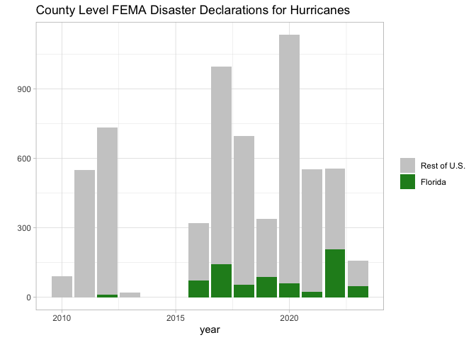

rfema (R FEMA)
================

- <a href="#introduction" id="toc-introduction">Introduction</a>
- <a href="#why-rfema" id="toc-why-rfema">Why rfema?</a>
- <a href="#installation" id="toc-installation">Installation</a>
- <a href="#usage" id="toc-usage">Usage</a>

[](https://github.com/ropensci/rfema/actions)
[](https://www.repostatus.org/#active)

[](https://www.tidyverse.org/lifecycle/#stable)
[](https://codecov.io/gh/ropensci/rfema?branch=main)
[](https://github.com/ropensci/software-review/issues/484)
[](https://zenodo.org/badge/latestdoi/406498163)

<!-- badges: start -->

<!-- [](https://github.com/dylan-turner25/rfema/actions) -->
<!-- badges: end -->

## Introduction

`rfema` allows users to access The Federal Emergency Management Agency’s
(FEMA) publicly available data through the open FEMA API. The package
provides a set of functions to easily navigate and access all data sets
provided by FEMA, including (but not limited to) data from the National
Flood Insurance Program and FEMA’s various disaster aid programs.

FEMA data is publicly available through the open [FEMA
website](https://www.fema.gov/about/openfema/data-sets) via their API.
FEMA's datasets are often very large (multiple gigabytes) and many times
users do not need all records for a data series (for example: many users
may only want records for a single state for several years). Using
FEMA's API allows users to query specific subsets of data, but can be
inaccessible for those without prior API experience. This package contains a set of functions
that allows users to easily identify and retrieve data from FEMA’s API
without needing any technical knowledge of APIs. Notably, the FEMA API
does not require an API key, meaning the package is extremely accessible
regardless of if the user has ever interacted with an API.

The rest of this page explains the benefits of the package and
demonstrates basic usage of the package. For those looking for more in
depth examples of how to use the package in your workflow, consider
reading the [Getting
Started](https://github.com/dylan-turner25/rfema/blob/main/vignettes/getting_started.md)
vignette.

In accordance with the Open Fema terms and conditions: This product uses
the Federal Emergency Management Agency’s Open FEMA API, but is not
endorsed by FEMA. The Federal Government or FEMA cannot vouch for the
data or analyses derived from these data after the data have been
retrieved from the Agency’s website(s). Guidance on FEMA’s preferred
citation for Open FEMA data can be found at:
<https://www.fema.gov/about/openfema/terms-conditions>.

## Why rfema?

What are the advantages of accessing the FEMA API through the `rfema`
package as compared to accessing the API directly? In short, the `rfema`
package handles much of the grunt work associated with constructing API
queries, dealing with API limits, and applying filters or other
parameters. Suppose one wants to obtain data on all of the flood
insurance claims in Florida for 2020. The following code obtains that
data without the use of the `rfema` package. As can be seen it requires
quite a few lines of code, in part due to the API limiting calls to 1000
records per call which can make obtaining a full data set cumbersome.

``` r
# Code needed to obtain data on flood insurance claims in FL without the rfema package ------------------

# define the url for the appropriate api end point
base_url <- "https://www.fema.gov/api/open/v2/FimaNfipClaims"

# append the base_url to apply filters
filters <- "?$inlinecount=allpages&$filter=(state%20eq%20'FL')%20and%20(yearOfLoss%20eq%202020)"

api_query <- paste0(base_url, filters)

# run a query setting the top_n parameter to 1 to check how many records match the filters
record_check_query <- "https://www.fema.gov/api/open/v2/FimaNfipClaims?$inlinecount=allpages&$top=1&$filter=(state%20eq%20'FL')%20and%20(yearOfLoss%20eq%202020)"

# run the api call and determine the number of matching records
result <- httr::GET(record_check_query)
jsonData <- httr::content(result)        
n_records <- jsonData$metadata$count 

# calculate number of calls neccesary to get all records using the 
# 1000 records/ call max limit defined by FEMA
iterations <- ceiling(n_records / 1000)

# initialize a skip counter which will indicate where in the full 
# data set each API call needs to start from.
skip <- 0

# make however many API calls are neccesary to get the full data set
for (i in seq(from = 1, to = iterations, by = 1)) {
  # As above, if you have filters, specific fields, or are sorting, add
  # that to the base URL or make sure it gets concatenated here.
  result <- httr::GET(paste0(api_query, "&$skip=", (i - 1) * 1000))
  if (result$status_code != 200) {
    status <- httr::http_status(result)
    stop(status$message)
  }
  json_data <- httr::content(result)[[2]]
  
  # for data returned as a list of lists, correct any discrepancies
  # in the length of the lists by adding NA values to the shorter lists
  
  # calculate longest list
  max_list_length <- max(sapply(json_data, length))
  
  # add NA values to lists shorter than the max list length
  json_data <- lapply(json_data, function(x) {
    c(x, rep(NA, max_list_length - length(x)))
  })
  
  if (i == 1) {
    # bind the data into a single data frame
    data <- data.frame(do.call(rbind, json_data))
  } else {
    data <- dplyr::bind_rows(
      data,
      data.frame(do.call(rbind, json_data))
    )
  }
}

 
# remove the html line breaks from returned data frame (if there are any)  
data <- as_tibble(lapply(data, function(data) gsub("\n", "", data)))

# view the retrieved data
data
```

    ## # A tibble: 9,986 × 73
    ##    agriculture…¹ asOfD…² basem…³ polic…⁴ crsCl…⁵ dateO…⁶ eleva…⁷ eleva…⁸ eleva…⁹
    ##    <chr>         <chr>   <chr>   <chr>   <chr>   <chr>   <chr>   <chr>   <chr>  
    ##  1 FALSE         2021-0… 0       1       5       2020-0… FALSE   NULL    1      
    ##  2 FALSE         2023-0… 0       1       6       2020-0… FALSE   1       NULL   
    ##  3 FALSE         2020-0… 2       1       7       2020-0… TRUE    3       -6     
    ##  4 FALSE         2022-0… 0       1       6       2020-0… FALSE   1       NULL   
    ##  5 FALSE         2023-0… 1       1       10      2020-0… FALSE   3       1      
    ##  6 FALSE         2023-0… NULL    1       6       2020-0… TRUE    NULL    0      
    ##  7 FALSE         2020-0… NULL    1       6       2020-0… FALSE   NULL    7      
    ##  8 FALSE         2022-1… 0       1       7       2020-0… FALSE   NULL    NULL   
    ##  9 FALSE         2022-1… 0       1       5       2020-0… FALSE   1       NULL   
    ## 10 FALSE         2023-0… 0       1       5       2020-0… FALSE   NULL    4      
    ## # … with 9,976 more rows, 64 more variables: baseFloodElevation <chr>,
    ## #   ratedFloodZone <chr>, houseWorship <chr>, locationOfContents <chr>,
    ## #   lowestAdjacentGrade <chr>, lowestFloorElevation <chr>,
    ## #   numberOfFloorsInTheInsuredBuilding <chr>, nonProfitIndicator <chr>,
    ## #   obstructionType <chr>, occupancyType <chr>, originalConstructionDate <chr>,
    ## #   originalNBDate <chr>, amountPaidOnBuildingClaim <chr>,
    ## #   amountPaidOnContentsClaim <chr>, …

Compare the above block of code to the following code which obtains the
same data using the `rfema` package. The `rfema` package allows the same
request to be made with two lines of code. Notably, the `open_fema()`
function handles checking the number of records and implements an
iterative loop to deal with the 1000 records/call limit.

``` r
# define a list of filters to apply
filterList <- list(state = "FL",yearOfLoss = "= 2020")

# Make the API call using the `open_fema` function. The function will output a 
# status message to the console letting you monitor the progress of the data retrieval.
data <- open_fema(data_set = "fimaNfipClaims",ask_before_call = F, filters = filterList)

# view data
data
```

    ## # A tibble: 9,986 × 73
    ##    agriculture…¹ asOfDate            basem…² polic…³ crsCl…⁴ dateOfLoss         
    ##    <chr>         <dttm>              <chr>   <chr>   <chr>   <dttm>             
    ##  1 FALSE         2021-03-30 00:00:00 0       1       5       2020-01-02 00:00:00
    ##  2 FALSE         2023-06-01 00:00:00 0       1       6       2020-01-03 00:00:00
    ##  3 FALSE         2020-07-17 00:00:00 2       1       7       2020-01-02 00:00:00
    ##  4 FALSE         2022-09-11 00:00:00 0       1       6       2020-01-05 00:00:00
    ##  5 FALSE         2023-02-14 00:00:00 1       1       10      2020-01-09 00:00:00
    ##  6 FALSE         2023-03-03 00:00:00 NULL    1       6       2020-01-01 00:00:00
    ##  7 FALSE         2020-04-20 00:00:00 NULL    1       6       2020-01-11 00:00:00
    ##  8 FALSE         2022-11-16 00:00:00 0       1       7       2020-01-04 00:00:00
    ##  9 FALSE         2022-12-02 00:00:00 0       1       5       2020-01-12 00:00:00
    ## 10 FALSE         2023-02-22 00:00:00 0       1       5       2020-01-21 00:00:00
    ## # … with 9,976 more rows, 67 more variables: elevatedBuildingIndicator <chr>,
    ## #   elevationCertificateIndicator <chr>, elevationDifference <chr>,
    ## #   baseFloodElevation <chr>, ratedFloodZone <chr>, houseWorship <chr>,
    ## #   locationOfContents <chr>, lowestAdjacentGrade <chr>,
    ## #   lowestFloorElevation <chr>, numberOfFloorsInTheInsuredBuilding <chr>,
    ## #   nonProfitIndicator <chr>, obstructionType <chr>, occupancyType <chr>,
    ## #   originalConstructionDate <dttm>, originalNBDate <dttm>, …

The `rfema` package also returns data, where possible, in formats that
are easier to work with. For example, all functions return data as a
tibble with all date columns converted to POSIX format. This makes
plotting time series easy as the API call can be piped directly into a
`ggplot` plot. For example, the following is a plot of the number of
FEMA disaster declarations in response to hurricanes since 2010,
separated out by Florida versus the rest of the United States. In an
application where the most up to date data is required, this block of
code can be rerun to plot the most up to date data from the FEMA API.

``` r
library(ggplot2)
open_fema("DisasterDeclarationsSummaries", 
                  filters = list(declarationDate = ">= 2010-01-01",
                                 incidentType = "Hurricane"), 
                  ask_before_call = F) %>% 
  mutate(date = lubridate::floor_date(declarationDate,"year"),count = 1,
         Florida = factor(state == "FL")) %>%
  select(date,count,Florida) %>%
  group_by(date,Florida) %>%
  summarise(count = sum(count)) %>%
  ggplot(., aes(fill=Florida, y=count, x=date)) + 
    geom_bar(position="stack", stat="identity") +
  scale_fill_manual(name = "",values = c("grey80","forestgreen"),drop = FALSE,
                    labels = c("Rest of U.S.","Florida")) +
  labs(x = "year",y = "",
       title = "County Level FEMA Disaster Declarations for Hurricanes") +
  theme_light()
```

<!-- -->

## Installation

Right now, the best way to install and use the `rfema` package is by
installing directly from rOpenSci using
`install.packages("rfema", repos = "https://ropensci.r-universe.dev")`.
The FEMA API does not require an API key, meaning no further setup
steps need be taken to start using the package.

## Usage

For those unfamiliar with the data sets available through the FEMA API,
a good starting place is to visit the [FEMA API documentation
page](https://www.fema.gov/about/openfema/data-sets). However, if you
are already familiar with the data and want to quickly reference the
data set names or another piece of meta data, using the
`fema_data_sets()` function to obtain a tibble of available data sets
along with associated meta data is a convenient option.

``` r
# store meta data for the available data sets as an object in the R environment
data_sets <- fema_data_sets()

# view the just retrieved data
data_sets
```

    ## # A tibble: 51 × 35
    ##    identif…¹ name  title descr…² webSe…³ dataD…⁴ keyword modif…⁵ publi…⁶ conta…⁷
    ##    <chr>     <chr> <chr> <chr>   <chr>   <chr>   <list>  <chr>   <chr>   <chr>  
    ##  1 openfema… Fema… FEMA… "This … https:… https:… <list>  2023-0… Federa… OpenFE…
    ##  2 openfema… Ipaw… IPAW… "The I… https:… https:… <list>  2020-0… Federa… OpenFE…
    ##  3 openfema… Regi… Regi… "This … https:… https:… <list>  2023-0… Federa… OpenFE…
    ##  4 openfema… Regi… Regi… "This … https:… https:… <list>  2023-1… Federa… OpenFE…
    ##  5 openfema… Fema… FEMA… "This … https:… https:… <list>  2023-0… Federa… OpenFE…
    ##  6 openfema… Haza… Haza… "The d… https:… https:… <list>  2023-1… Federa… OpenFE…
    ##  7 openfema… Hous… Hous… "This … https:… https:… <list>  2023-0… Federa… OpenFE…
    ##  8 openfema… Hous… Hous… "The d… https:… https:… <list>  2023-0… Federa… OpenFE…
    ##  9 openfema… Indi… Indi… "This … https:… https:… <list>  2020-0… Federa… OpenFE…
    ## 10 openfema… Miss… Miss… "1.1 W… https:… https:… <list>  2023-0… Federa… OpenFE…
    ## # … with 41 more rows, 25 more variables: mbox <chr>, accessLevel <chr>,
    ## #   landingPage <list>, temporal <list>, api <lgl>, version <int>,
    ## #   bureauCode <chr>, programCode <chr>, license <list>, theme <list>,
    ## #   dataQuality <chr>, accrualPeriodicity <list>, language <chr>,
    ## #   references <list>, issued <list>, recordCount <list>, depDate <list>,
    ## #   depApiMessage <list>, depWebMessage <list>, depNewURL <list>, hash <chr>,
    ## #   lastRefresh <chr>, id <chr>, lastDataSetRefresh <list>, …

Once you have the name of the data set you want, simply pass it as an
argument to the `open_fema()` function which will return the data set as
a tibble. By default, `open_fema()` will warn you if the number of
records is greater than 1000 and present an estimated time required to
complete the records request. As the user, you will then be asked to
confirm that you want to retrieve all of the available records (for many
data sets the total records is quite large). To turn off this feature,
set the parameter `ask_before_call` equal to FALSE. To limit the number
of records returned, specify the `top_n` argument. This is useful for
exploring a data set without retrieving all records.

``` r
# obtain the first 10 records from the fimaNfipClaims data set.
# Note: the data_set argument is not case sensitive
retrieved_data <- open_fema(data_set = "fimanfipclaims", top_n = 10)

# view the data
retrieved_data
```

    ## # A tibble: 10 × 73
    ##    agriculture…¹ asOfDate            basem…² polic…³ crsCl…⁴ dateOfLoss         
    ##    <chr>         <dttm>              <chr>   <chr>   <chr>   <dttm>             
    ##  1 FALSE         2020-01-22 00:00:00 NULL    1       8       1998-02-07 00:00:00
    ##  2 FALSE         2020-01-22 00:00:00 NULL    1       8       2005-08-29 00:00:00
    ##  3 FALSE         2020-01-22 00:00:00 NULL    1       9       1998-09-28 00:00:00
    ##  4 FALSE         2019-09-19 00:00:00 1       1       9       1994-10-07 00:00:00
    ##  5 FALSE         2019-09-19 00:00:00 NULL    1       8       1996-03-11 00:00:00
    ##  6 FALSE         2020-01-22 00:00:00 NULL    1       NULL    1998-02-03 00:00:00
    ##  7 FALSE         2020-01-22 00:00:00 NULL    1       5       2017-08-27 00:00:00
    ##  8 FALSE         2019-10-19 00:00:00 NULL    1       NULL    1992-09-11 00:00:00
    ##  9 FALSE         2019-10-19 00:00:00 NULL    1       8       1998-09-28 00:00:00
    ## 10 FALSE         2019-09-19 00:00:00 NULL    1       8       1995-03-11 00:00:00
    ## # … with 67 more variables: elevatedBuildingIndicator <chr>,
    ## #   elevationCertificateIndicator <chr>, elevationDifference <chr>,
    ## #   baseFloodElevation <chr>, ratedFloodZone <chr>, houseWorship <chr>,
    ## #   locationOfContents <chr>, lowestAdjacentGrade <chr>,
    ## #   lowestFloorElevation <chr>, numberOfFloorsInTheInsuredBuilding <chr>,
    ## #   nonProfitIndicator <chr>, obstructionType <chr>, occupancyType <chr>,
    ## #   originalConstructionDate <dttm>, originalNBDate <dttm>, …

There are a variety of other ways to more precisely target the data you
want to retrieve by specifying how many records you want returned,
specifying which columns in a data set to return, and applying filters
to any of the columns in a data set. For more information and examples
of use cases, see the [Getting
Started](https://github.com/ropensci/rfema/blob/main/vignettes/getting_started.md)
vignette.

------------------------------------------------------------------------

Please note that `rfema` is released with a [Contributor Code of
Conduct](https://ropensci.org/code-of-conduct/#:~:text=rOpenSci%20is%20committed%20to%20providing,understand%E2%80%9D%20or%20%E2%80%9CWhy%E2%80%9D.).
By contributing to the package you agree to abide by its terms.
